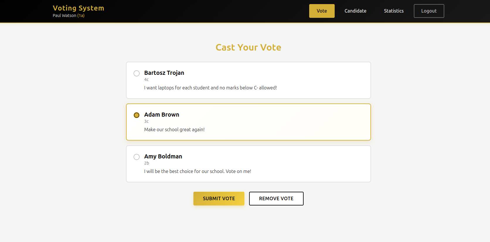
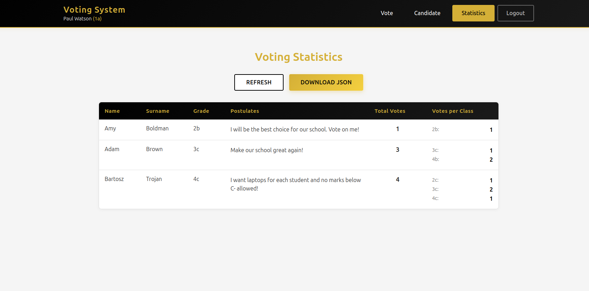

# Voting App

A full-stack web application for managing student elections in a school environment. Students can register, view candidates, cast votes, and see real-time voting statistics.

## 📋 Overview

This application provides a complete voting system for school elections with the following features:

- **User Authentication**: Students log in with their name, surname, and class
- **Candidate Management**: Students can register as candidates with their postulates
- **Voting System**:W Users can vote for their preferred candidate
- **Real-time Statistics**: View vote counts and detailed statistics per class
- **Vote Management**: Users can change or remove their votes

## 🏗️ Architecture

The application consists of three main components:

### Backend (FastAPI + PostgreSQL)
- **Framework**: FastAPI (Python)
- **Database**: PostgreSQL 15
- **ORM**: SQLAlchemy
- **API**: RESTful API with CORS support

### Frontend (React + TypeScript)
- **Framework**: React 18 with TypeScript
- **Styling**: Custom CSS
- **State Management**: React Hooks (useState, useEffect)
- **Local Storage**: Persists user session

### Database Schema
- **Classes**: Predefined school classes (1a-4c)
- **Users**: Students who can vote
- **Candidates**: Students running for election
- **Votes**: Stored as foreign key relationship in User table

## 🚀 Getting Started

### Prerequisites

- Docker and Docker Compose installed on your system
- Ports 3000 (frontend), 8000 (backend), and 5555 (database) available

### Installation & Running

1. **Clone the repository**
   ```bash
   git clone <repository-url>
   cd voting_app
   ```

2. **Start the application**
   ```bash
   docker compose up --build
   ```

   This command will:
   - Build and start the PostgreSQL database
   - Build and start the FastAPI backend server
   - Build and start the React frontend application
   - Initialize the database with predefined classes (1a, 1b, 1c, 2a, 2b, 2c, 3a, 3b, 3c, 4a, 4b, 4c)

3. **Access the application**
   - **Frontend**: Open your browser and navigate to `http://localhost:3000`
   - **Backend API**: `http://localhost:8000`
   - **API Documentation**: `http://localhost:8000/docs` (Swagger UI)

4. **Stop the application**
   ```bash
   docker compose down
   ```

   To remove all data including the database:
   ```bash
   docker compose down -v
   ```

## 📱 How to Use

### First Time Setup

1. **Register as a User**
   - Enter your name, surname, and select your class
   - Click "ENTER" to create your account
   - You'll automatically be logged in


### Main Features

2. **Vote for a Candidate**
   - Navigate to the "Vote" page
   - Browse available candidates and their postulates
   - Click "Vote" on your preferred candidate
   - You can change your vote at any time by clicking "Unvote" and voting again



3. **Register as a Candidate**
   - Navigate to the "Candidate" page
   - Enter your postulates (campaign promises)
   - Click "Add as Candidate"
   - You can remove your candidacy at any time

4. **View Statistics**
   - Navigate to the "Stats" page
   - See total votes for each candidate
   - View vote distribution across different classes
   - Statistics update in real-time



### User Flow

```
Login → Vote/View Candidates → Optional: Become a Candidate → View Stats → Logout
```

## 🔧 Technical Details

### API Endpoints

- `POST /get-classes` - Retrieve all available classes
- `POST /add-user` - Register a new user
- `POST /add-candidate` - Register a candidate
- `POST /remove-candidate` - Remove candidate registration
- `POST /get-candidates` - Get all candidates with details
- `POST /vote` - Cast a vote
- `POST /unvote` - Remove current vote
- `POST /who-am-i-voting` - Check current vote
- `POST /is-candidate` - Check if user is a candidate
- `POST /get-stats` - Get voting statistics

### Environment Variables

Database configuration (defined in `docker-compose.yaml`):
- `POSTGRES_USER`: admin
- `POSTGRES_PASSWORD`: password123
- `POSTGRES_DB`: voting_app

### Port Configuration

- Frontend: `3000`
- Backend: `8000`
- PostgreSQL: `5555` (mapped from internal 5432)

## 📁 Project Structure

```
voting_app/
├── backend/
│   ├── Dockerfile
│   ├── main.py              # FastAPI application
│   └── requirements.txt     # Python dependencies
├── frontend/
│   ├── Dockerfile
│   ├── package.json
│   ├── public/
│   └── src/
│       ├── App.tsx          # Main application component
│       ├── api.ts           # API client functions
│       ├── types.ts         # TypeScript type definitions
│       ├── components/      # Reusable components
│       │   ├── Layout.tsx
│       │   └── Navigation.tsx
│       └── pages/           # Page components
│           ├── LoginPage.tsx
│           ├── VotePage.tsx
│           ├── CandidatePage.tsx
│           └── StatsPage.tsx
└── docker-compose.yaml      # Docker orchestration
```

## 🛠️ Development

### Backend Development

The backend uses hot-reload. Changes to Python files will automatically restart the server.

### Frontend Development

The frontend uses React's development server with hot module replacement. Changes will reflect immediately in the browser.

### Database Access

To access the PostgreSQL database directly:
```bash
docker exec -it postgres_db psql -U admin -d voting_app
```

## ⚙️ Features

- ✅ User registration and authentication
- ✅ Candidate registration with postulates
- ✅ Single vote per user (can be changed)
- ✅ Real-time vote statistics
- ✅ Vote breakdown by class
- ✅ Responsive user interface
- ✅ Persistent data storage
- ✅ Session management via localStorage

## 📝 License

This project is available for educational purposes.

## 🤝 Contributing

Feel free to submit issues and enhancement requests!
